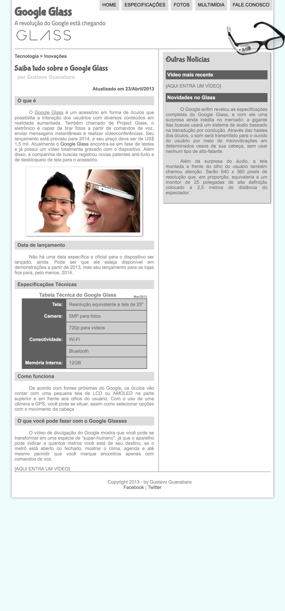
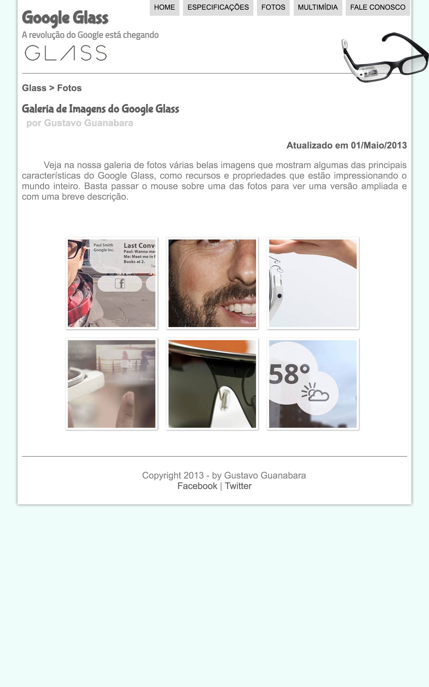
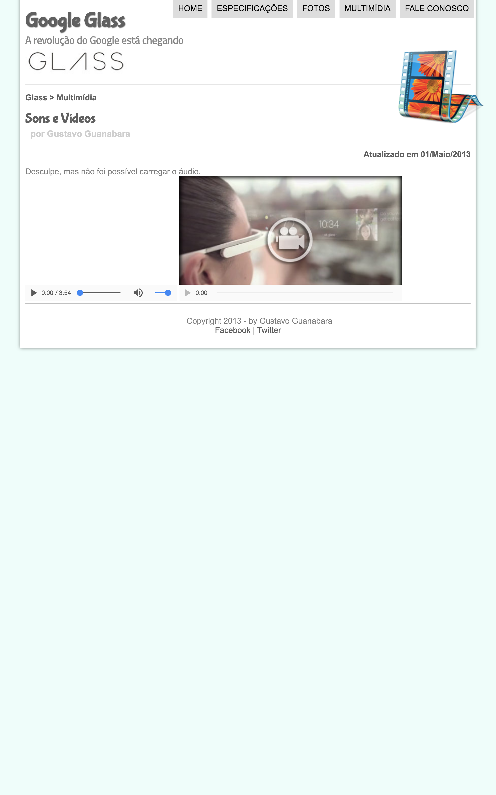
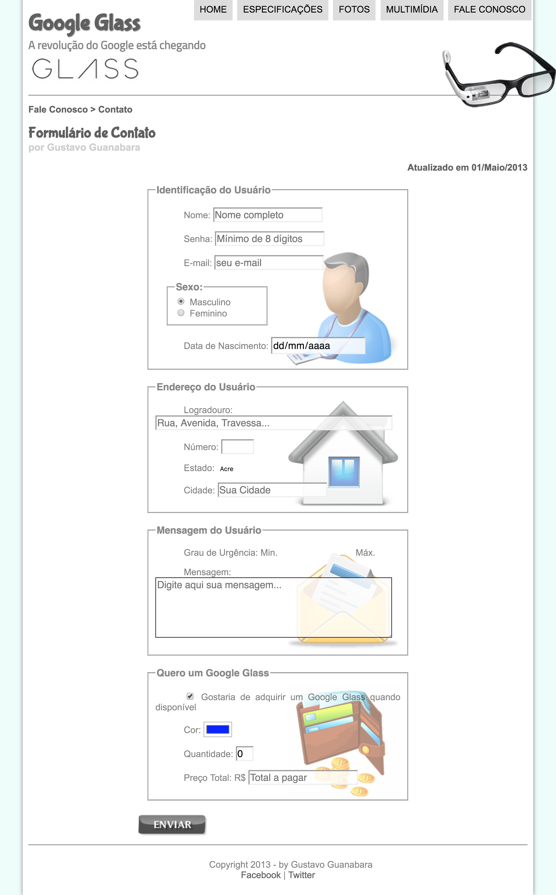

# projeto-glass-html5
Projeto do site "Google Glass" feito durante o [curso de HTML5](https://www.cursoemvideo.com/course/curso-de-html5/) do [Cursos em Vídeo)](https://www.cursoemvideo.com) ministrado pelo [professor Gustavo Guanabara](https://www.facebook.com/gustavoguanabara).

## Capturas de tela do projeto atual

